# LugGo

旅行者向け手荷物配送を行う事業者のための SaaS（B2B2C）です。
予約フォーム・決済・予約管理・配達者管理・売上管理までを一括で運用でき、**固定費は完全無料**（決済手数料型）で始められます。

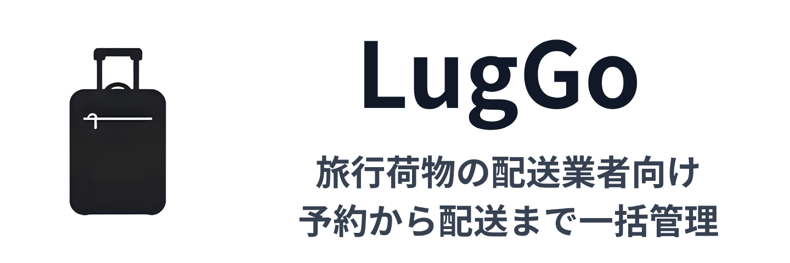

## サービス URL

- 公開サイト: [https://luggo.delivery](https://luggo.delivery)
- テストテナント（予約フォーム）: [https://luggo.luggo.delivery](https://luggo.luggo.delivery)

※ 事業者ごとに `{subdomain}.luggo.delivery` の予約フォームが発行されます。
※ テストテナントでは**実際に決済される**ため、操作にはご注意ください。

## 概要

LugGo は、手荷物配送事業者が自前で予約・運用システムを一から作らずに済むようにするプラットフォームです。

| 利用者 | できること                                            |
| --- | ------------------------------------------------ |
| 旅行者 | 予約フォームから集荷／配達の場所・日時を入力し、決済して予約。照会・領収書発行・キャンセルも可能 |
| 事業者 | 専用予約フォームの作成、予約管理、配達者管理、集荷／配達の割当（日次自動割当可）、売上管理    |
| 配達者 | 担当予約の確認、集荷・配達完了、ナビ連携したルート確認、最適な集荷／配達ルートの生成       |

### 解決する課題

- 旅行中の大きな荷物を、ホテル ⇔ 空港などに運んでもらいたい旅行者
- 予約フォームや予約／配達者／売上管理を、自前で一から作りたくない配送事業者

### ビジネスモデル

| 項目    | 料率 / 金額  |
| ----- | -------- |
| 初期費用  | 0円       |
| 月額費用  | 0円       |
| 決済手数料 | 決済額の 10% |

## 開発した背景

親友が配送事業を営んでおり、「今使っている配送管理システムが使いづらいから、システムを作ってくれないか」と相談を受けたことがきっかけです。
需要が不確かな Web アプリより、**確実に必要とされるものを作りたい**と考え、実績作りも兼ねて LugGo を開発しました。

実際に何度か配送にも同行し、既存システムの使いづらさを体感しました。例えば次のような点です。

- 配達者ダッシュボードで、ログインのたびに自分自身を選び直す必要がある
- 集荷先／配達先を毎回ナビに手入力する必要がある
- 効率的な配達ルートを自分で考えなければならない
- 配達ステータスの変更のたびに紙の二次元コードを読み取る必要がある
- 受取サインを毎回紙で取る必要がある
- 予約時の施設名検索がリアクティブなサジェストではない
- 荷物個数がセレクトボックスのみで直感的でない

LugGo では、配達者ごとの専用ダッシュボード、Google API によるナビ／ルート提案、各配達者に集荷／配達タスクを紐づけて配達ステータス更新を簡略化、電子サイン、集荷／配達場所のサジェスト、荷物個数の増減 UI などで、これらの課題に応えています。

### この市場を選んだ理由

- 大手が参入しづらいニッチな市場であること
- インバウンド需要が見込めること
- 運送事業者の受付・決済・運用のデジタル化が遅れがちであること

## 競合との立ち位置

多くの有名サービスは **自社（または提携）で配送する旅行者向け（B2C）** です。
LugGo は **配送事業者向けの予約・運用プラットフォーム（B2B2C）** で、配送そのものではなく「仕組み」を提供します。

| 観点    | 多くの競合（B2C）     | LugGo（B2B2C）                |
| ----- | -------------- | --------------------------- |
| 誰に売るか | 主に旅行者          | 主に**配送事業者** |
| 何を売るか | 配送そのもの | **予約・決済・運用のシステム**           |
| ブランド  | 自社サービス名で統一     | 事業者ごとのサブドメイン / 自社ブランド       |
| 配送主体  | 自社・大手提携など      | **加盟事業者が配送**                |
| 収益    | 配送料金           | **決済手数料**             |

## 画面・機能の説明

### 操作デモ

<table>
  <tr>
    <td width="50%" valign="top">
      
<strong>荷物配送予約</strong>

      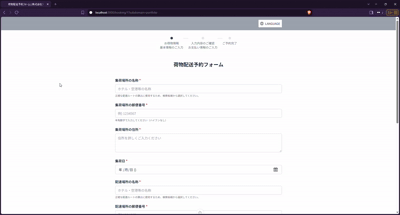
    </td>
    <td width="50%" valign="top">
      
<strong>日次自動割当</strong>

      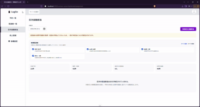
    </td>
  </tr>
  <tr>
    <td width="50%" valign="top">
      
<strong>配達者ダッシュボード</strong>

      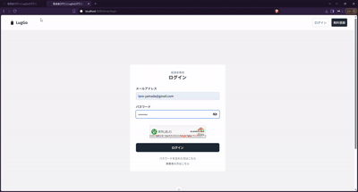
    </td>
    <td width="50%" valign="top">
      
<strong>Stripe アカウント登録申請</strong>

      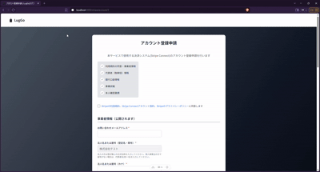
    </td>
  </tr>
</table>

### 旅行者向け

<table>
  <tr>
    <td width="50%" valign="top">
      
<strong>予約フォーム画面</strong>

      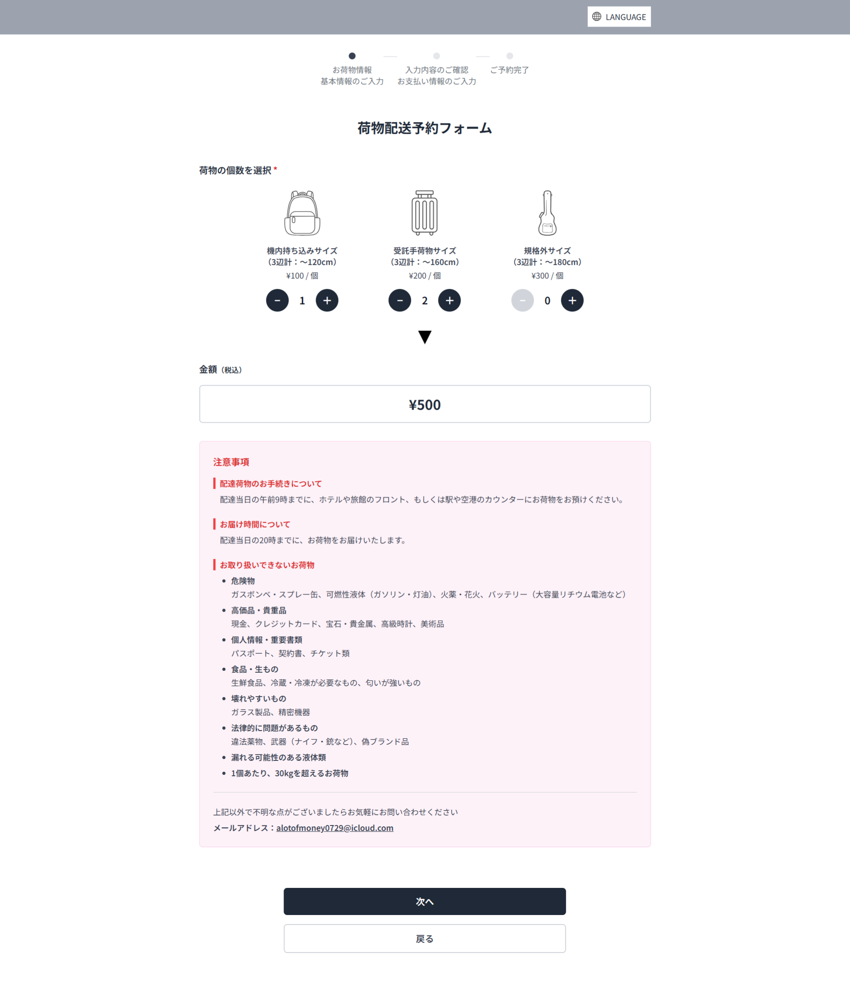
      
ユーザー（旅行者）が荷物配送予約を行うフォーム。集荷場所／配達場所、集荷日／配達日、荷物の種類／個数を入力し、カードで決済して予約できます。集荷／配達可能場所、集荷／配達可能日、配送可能な荷物の種類、1日の最大配送個数などは事業者ダッシュボードで設定できます。その設定外の入力にはエラーを表示し、予約できないようにしています。

    </td>
    <td width="50%" valign="top">
      
<strong>予約状況確認画面</strong>

      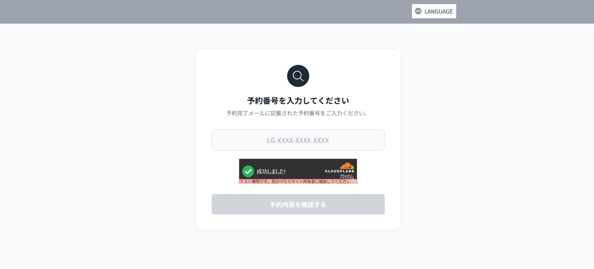
      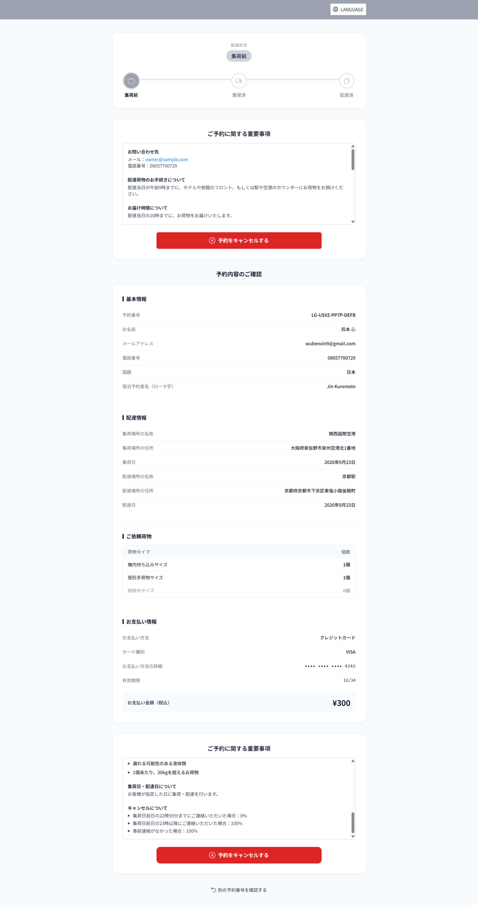
      
旅行者が予約番号を入力して、予約内容や配達状況を照会する画面。配達状況の確認に加え、予約のキャンセルも行えます。集荷完了後はキャンセルできなくなり、代わりに領収書をダウンロードできます。

    </td>
  </tr>
</table>

### 事業者向け

<table>
  <tr>
    <td width="50%" valign="top">
      
<strong>事業者アカウント登録画面</strong>

      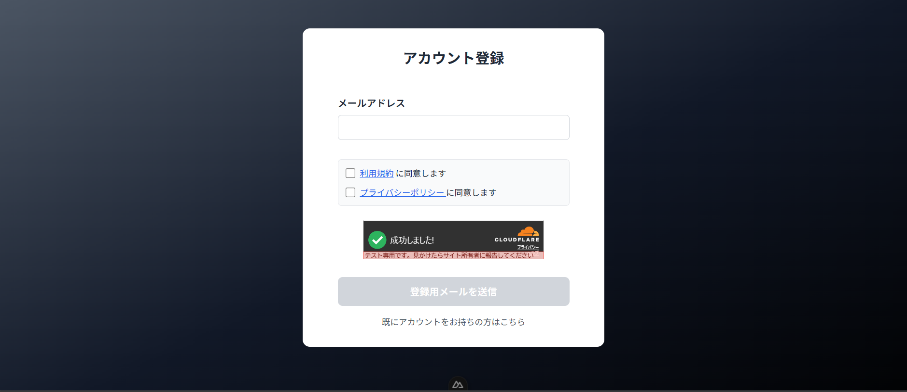
      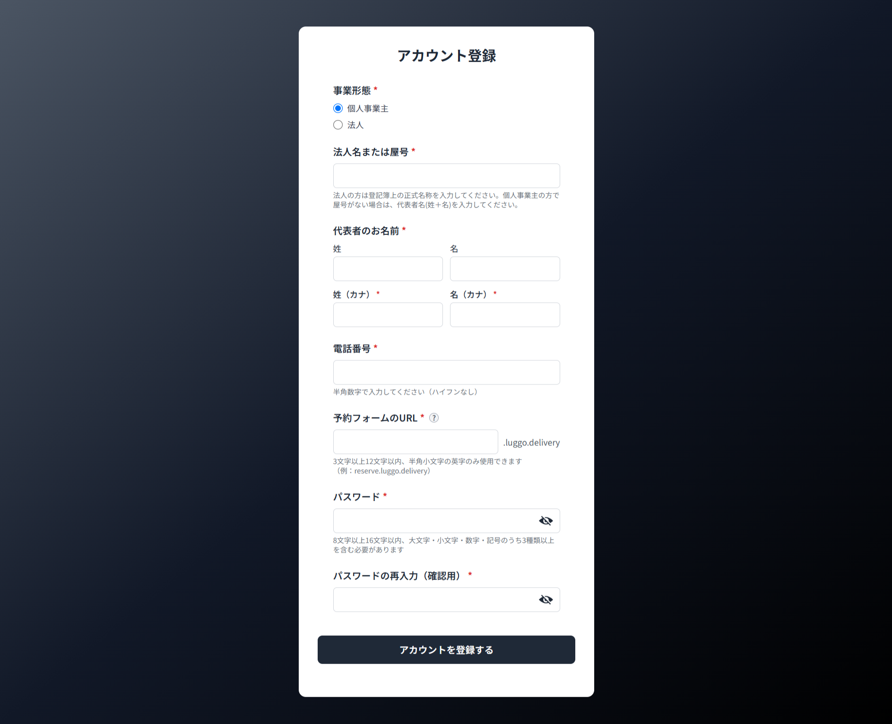
      
利用規約・プライバシーポリシーへの同意後、メールアドレスを登録すると確認メールが届きます。メール内のリンク先で個人事業主／法人を選択し、情報入力と独自予約URL（サブドメイン）の設定を行ってアカウントを開設します。サブドメインは一意で、同一メールでの複数アカウント作成はできません。

    </td>
    <td width="50%" valign="top">
      
<strong>事業者ログイン画面</strong>

      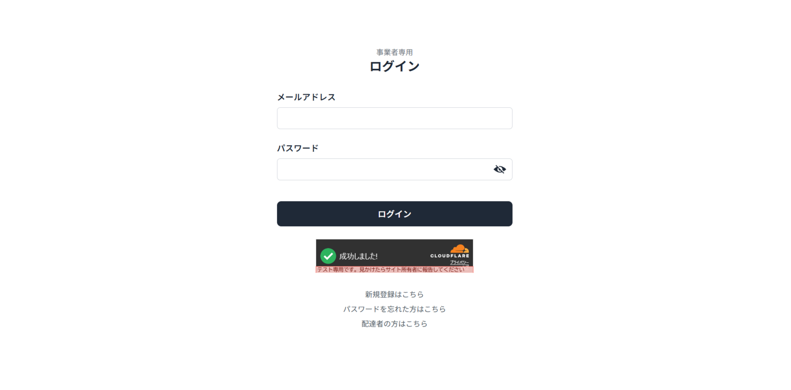
      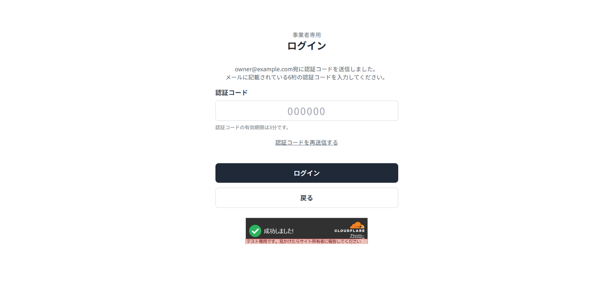
      
メールアドレスとパスワード入力後、メールに届く認証コードでログインします（二段階認証）。認証コードには有効期限があり、再送信も可能です。

    </td>
  </tr>
  <tr>
    <td width="50%" valign="top">
      
<strong>Stripe アカウント登録申請画面</strong>

      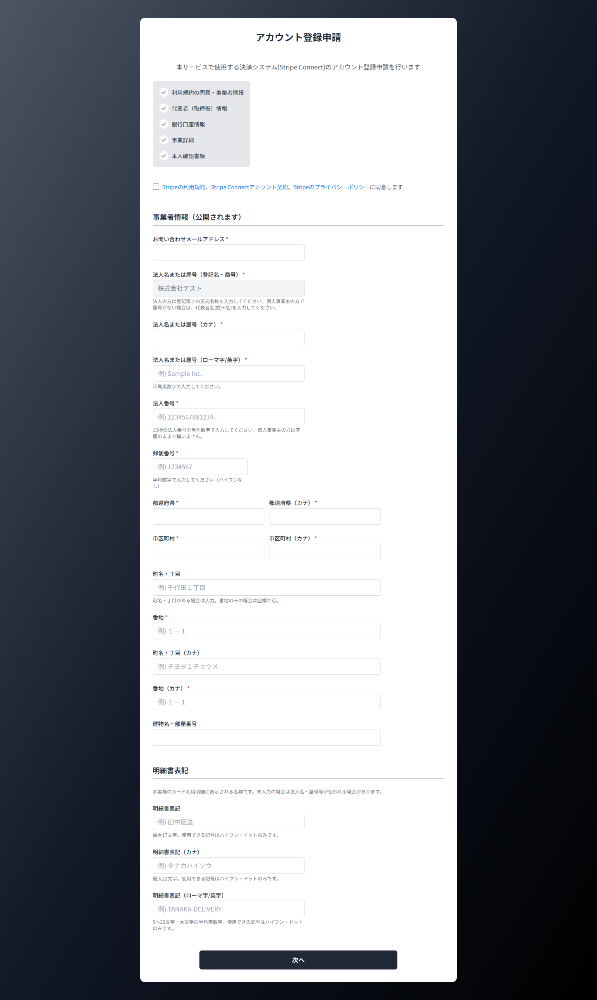
      
事業者アカウント登録後に Stripe Connect（Custom）へ申請する画面です。審査通過後に決済受付が可能になります。法人名・業種・サービス説明などをシステム側で事前入力し、事業者の入力負担を減らしています。

    </td>
    <td width="50%" valign="top">
      
<strong>予約一覧画面</strong>

      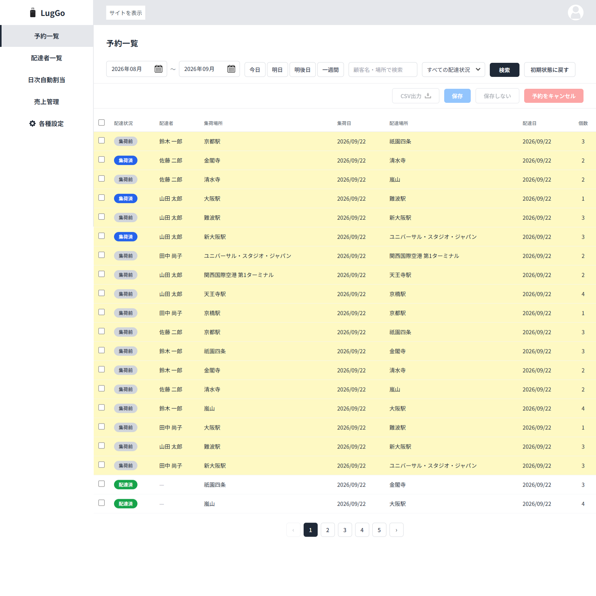
      
日付や配達ステータス、キーワードで絞り込み、予約詳細の確認、集荷／配達担当の割当、ステータス更新、CSV出力、キャンセルや返金対応ができます。

    </td>
  </tr>
  <tr>
    <td width="50%" valign="top">
      
<strong>配達者一覧画面</strong>

      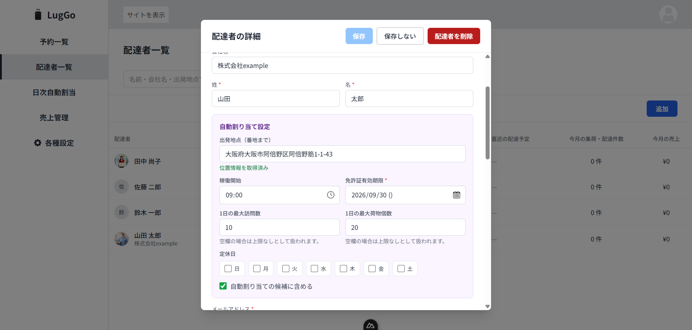
      
配達者の検索・追加・詳細編集・削除ができます。出発地点、稼働条件、免許証有効期限、自動割当候補かどうかなどを設定します。登録時は招待メールを送り、配達者がリンクからパスワードを設定して承諾するとアカウントが作成されます。

    </td>
    <td width="50%" valign="top">
      
<strong>日次自動割当画面</strong>

      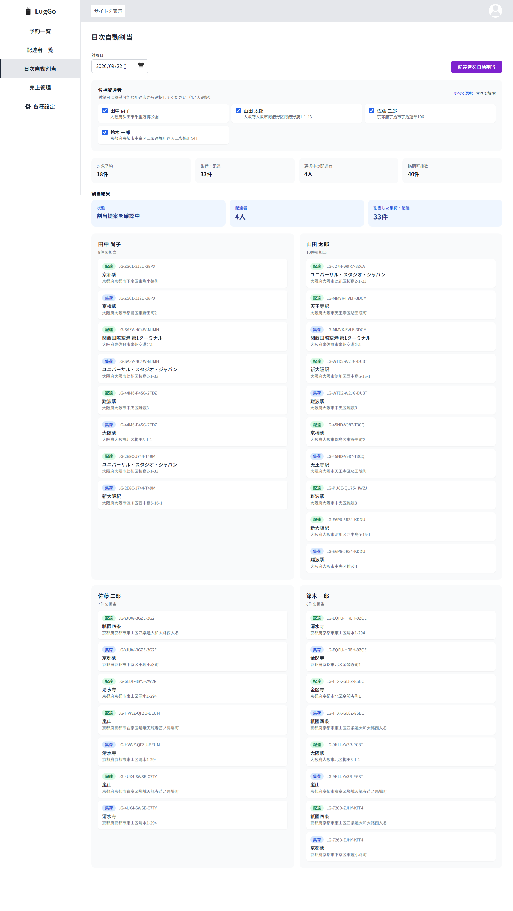
      
その日の集荷・配達を、稼働可能な配達者へ自動で割り振ります。対象日と候補配達者を選び、最適化の担当案（ドラフト）を確認してから本番へ適用できます。手動割当との併用や、割り当てできなかったタスクの確認にも対応しています。

    </td>
  </tr>
  <tr>
    <td width="50%" valign="top">
      
<strong>配送料金設定画面</strong>

      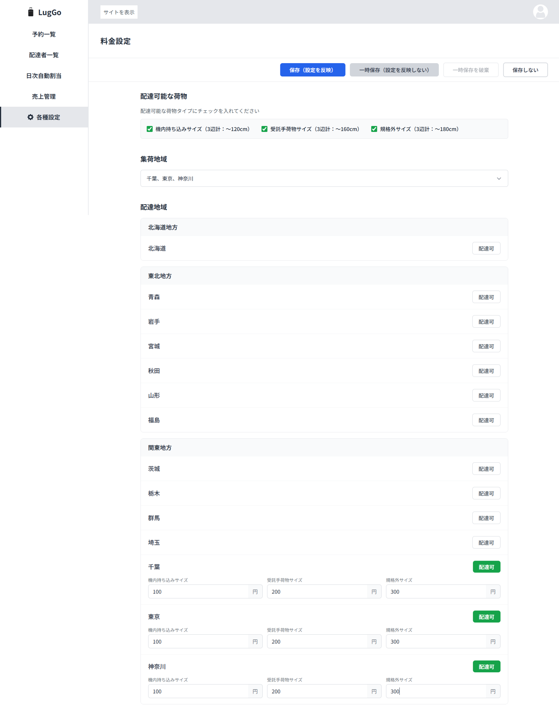
      
取り扱う荷物サイズ、集荷可能な地域、配達可能な都道府県とその料金を設定します。機内持ち込み／受託手荷物／規格外ごとに料金を入力でき、予約フォームの料金計算とエリア制約に反映されます。

    </td>
    <td width="50%" valign="top">
      
<strong>事業設定画面</strong>

      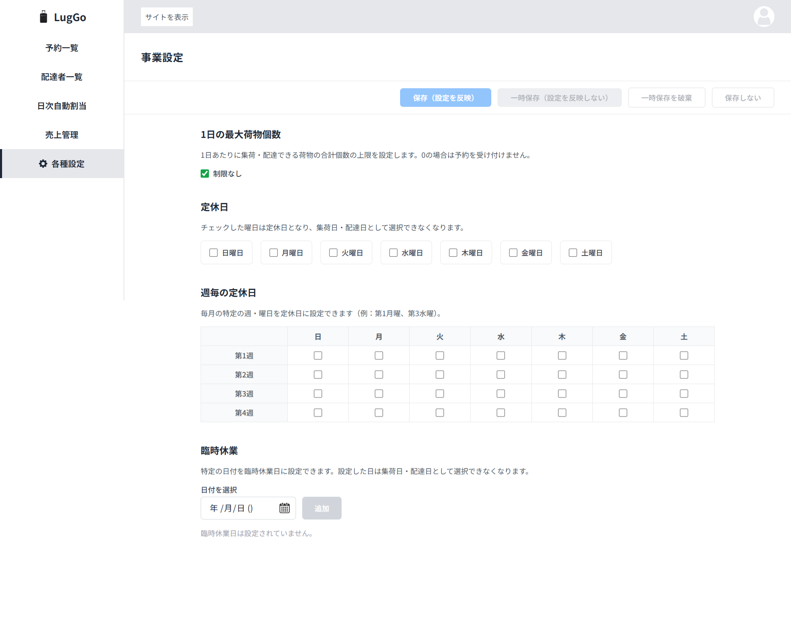
      
1日の最大荷物個数、曜日定休日、第N週の曜日定休日、臨時休業日を設定します。予約フォームの集荷日／配達日の選択可否に反映され、定休日や上限を超える日は予約できません。

    </td>
  </tr>
</table>

### 配達者向け

<table>
  <tr>
    <td width="50%" valign="top">
      
<strong>配達者予約一覧画面</strong>

      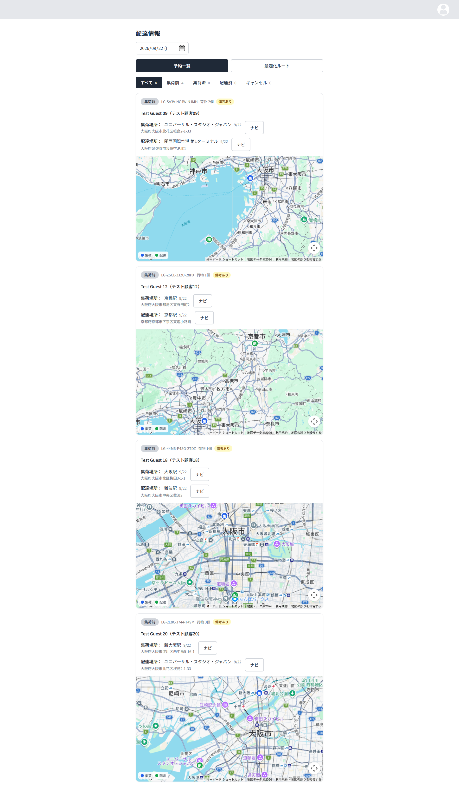
      
割り当てられた集荷・配達を日付やステータスで確認し、詳細から集荷済／配達済へ更新できます。電子サイン、施設手数料や交通費の登録、ナビへの遷移にも対応しています。

    </td>
    <td width="50%" valign="top">
      
<strong>配達者最適化ルート画面</strong>

      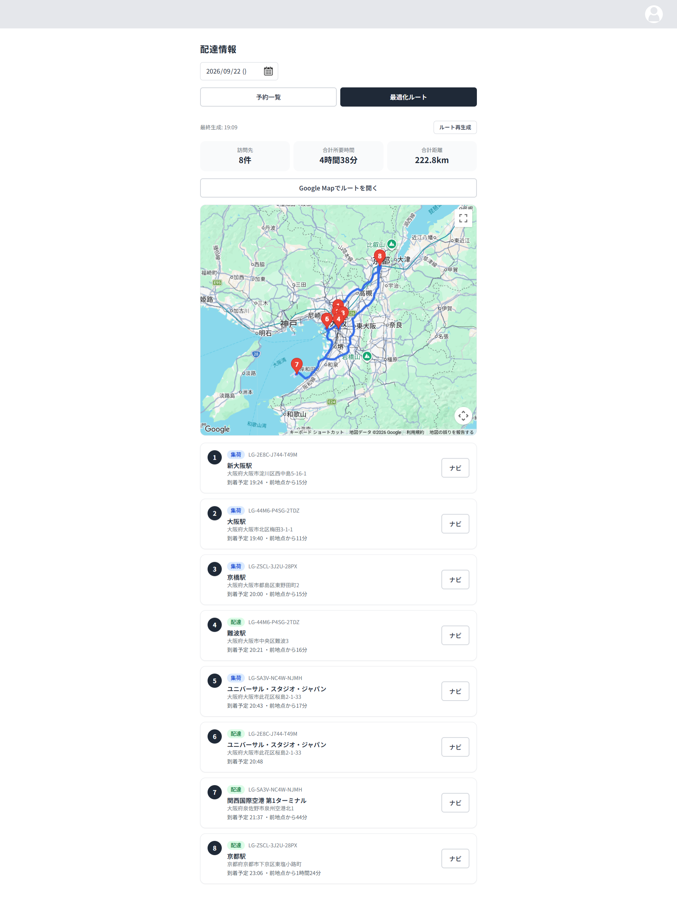
      
集荷・配達地点を効率的な巡回順で確認する画面です。訪問順・距離・所要時間を地図とリストで表示されます。加えて Google Maps の起動やルート再生成ができます。

    </td>
  </tr>
</table>

## 主な使用技術

### 全体

| カテゴリー   | 技術                                                                  |
| ------- | ------------------------------------------------------------------- |
| アーキテクチャ | Nuxt SSR + Django REST API                                          |
| 決済      | Stripe（Stripe Connect / Custom）                                     |
| 地図・地理   | Google Maps Platform（Maps JavaScript / Places / Geocoding / Routes） |
| 認証      | Cookie + Session                                    |
| ボット対策   | Cloudflare Turnstile                                                |
| 監視      | Sentry / UptimeRobot                                                |
| CI/CD   | GitHub Actions / Cloudflare Pages                                   |
| デザイン    | Adobe XD                                                            |

### フロントエンド

| カテゴリー   | 技術                                    |
| ------- | ------------------------------------- |
| 言語      | TypeScript                            |
| フレームワーク | Nuxt 4 / Vue 3                        |
| インフラ    | Cloudflare Pages                      |
| UI      | Tailwind CSS                          |
| フォーム    | VeeValidate / Yup                     |
| 多言語     | vue-i18n（ja / en / zh-Hans / zh-Hant） |
| テスト     | Vitest / happy-dom / Playwright       |

### バックエンド

| カテゴリー   | 技術                                                                                         |
| ------- | ------------------------------------------------------------------------------------------ |
| 言語      | Python                                                                                     |
| フレームワーク | Django / Django REST Framework                                                             |
| アプリサーバー | Gunicorn                                                                                   |
| 非同期     | Celery + Redis                                                                             |
| 日次自動割当 | OR-Tools                                                                                   |
| DB      | PostgreSQL                                                                                 |
| メディア    | Amazon S3                                                                                  |
| メール     | Resend                                                                                     |
| インフラ    | AWS（ECS Fargate / ALB / ACM / RDS / ElastiCache / S3 / ECR / Secrets Manager / CloudWatch） |
| テスト     | Django 標準テスト                                                                               |

## 技術選定・設計のポイント

| テーマ                       | 方針                                                                      |
| ------------------------- | ----------------------------------------------------------------------- |
| SSR（Nuxt）                 | 事業者ごとに内容が変わり、設定変更をすぐ出す必要があるため。全テナントの静的ビルドは現実的でない                        |
| Stripe Connect            | 旅行者が払い事業者が受け取る形で、手数料 10% を差し引いて送金するため                                   |
| 送金方式（Stripe Transfer） | Destination Charge ではなく Transfer を採用。決済はプラットフォームで受け、**配達完了後**に事業者へ送金するため（途中キャンセル・返金・未配達があるため） |
| Cookie + Session          | ブラウザ利用が主で、HttpOnly Cookie によりトークン漏洩を抑え、`.luggo.delivery` でログイン状態を共有しやすい |
| Celery + Redis / OR-Tools | 自動割当が重く API 内で解くとタイムアウトするため非同期化し、無料の最適化ライブラリを採用                         |
| ECS Fargate               | Django と Celery をコンテナのまま動かし、サーバ管理を増やさないため                               |
| Connect Custom            | 会社名や業種などを事前入力し、事業者の Stripe 登録負担を下げるため                                   |

## 工夫したポイント / 苦労した点

### 決済の堅牢さ

フロントの金額を信じず、**サーバー再計算と Stripe 上の金額を正**としました。

- 料金のサーバー側再計算とフロント金額の突合
- PaymentIntent 成功確認後の予約作成
- 仮保存＋ Webhook による予約復元（通信切れ対策）
- 予約作成・送金の冪等性
- **配達完了後**の事業者送金
- 返金時の手数料整合

### Stripe Connect の条件分岐

個人／法人、取締役の有無、日本特有の氏名・住所表記などにより、Stripe が求めるパラメータが変わります。
フロントの入力・バリデーションとバックエンドの API 変換をセットで合わせ、**更新時は不足要件だけを出す**ようにしました。

### 現場オペレーション

自動割当（OR-Tools + Celery）、最適化ルート、電子サイン、ナビ連携で、配達現場の手間を減らしています。

## セキュリティ

| 内容     | 詳細                                                          |
| ------ | ----------------------------------------------------------- |
| ログイン   | パスワード（事業者はメール認証コード付き）                                       |
| Cookie | HttpOnly / Secure / SameSite=Lax / Domain=`.luggo.delivery` |
| 通信     | HTTPS 強制、CORS・CSRF の許可オリジン制限                                |
| ボット対策  | Turnstile、IP レート制限、ログイン失敗ブロック                               |
| 決済     | 金額のサーバー再計算、カード情報は保持しない、二重送金防止                               |

## ER図

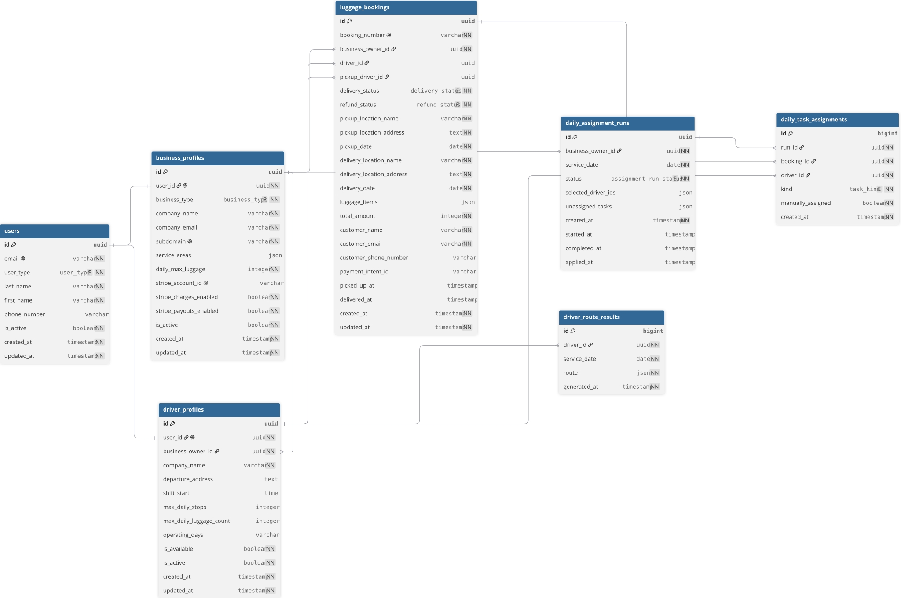

## インフラ構成図

フロントエンドは Cloudflare、バックエンドは AWS に配置しています。

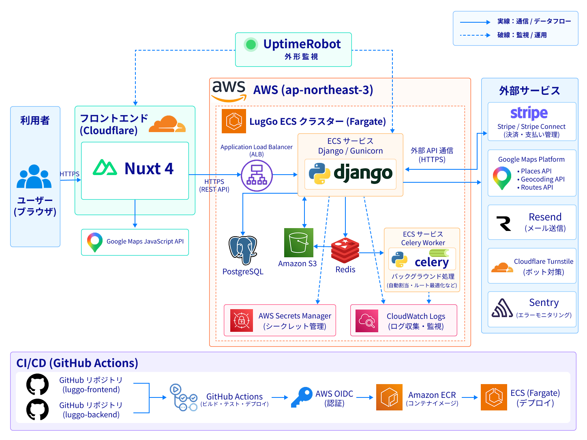

## 今後の展望

- 都道府県より細かい地域区分での配送料金設定
- 導入施設向け管理画面（予約タグ発行、キックバック設計など）
- 旅行者備考の日本語への自動翻訳
- 配達者向けネイティブアプリ
- パスキーログイン
- 事業者ダッシュボードのレスポンシブ対応
- 決済手段の拡充（PayPay など）
- 監視機能の強化
- ダークモードの実装
